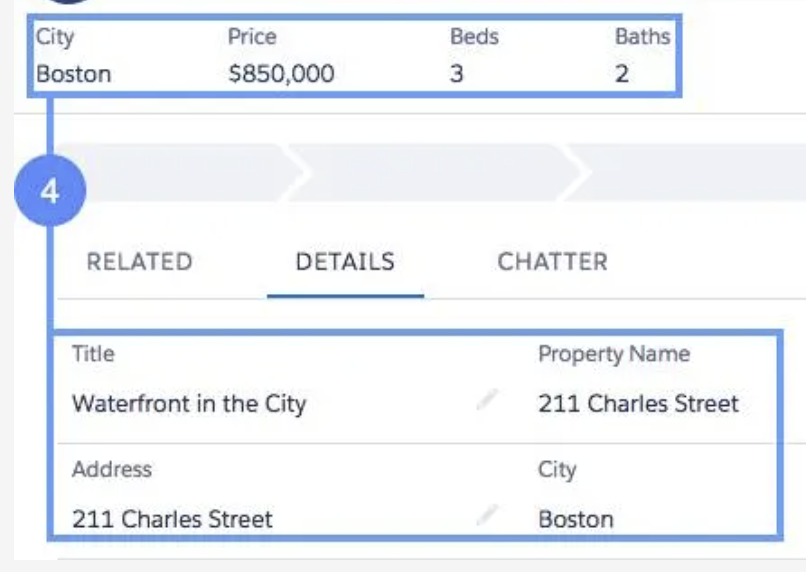

# Terms

## Database

A database is basically a giant spreadsheet. When you add info to salesforce it is stored in this spreadsheet.

## Objects

2 in the image. Objects are individual tables in database that stores a particular type of info.

There are **Standard Objects**, which are provided by default by salesforce, and there are **Custom Objects** which are made by you.

## Records

3 in the image. Records are rows in your objects table which is in your database.

## Fields

Fields are columns in your objects table which is in your database.

---

Lets pause and put these three together. Lets translate this full example into our database.

Database: DreamHouse
Table 1: Property

Record             | City   | Price    | Beds | Baths | etc |
| ------ | ------ | ------ | ------ | ------ | ------ |
211 Charles Street | Boston | $850,000 | 3 | 2 | ...

Here is a more comprehensive example, (Again, pulled from trailhead training module)

`Object` - **Property**: The whole spreadsheet itself.
`Record` - **Property Name**: Each row, where property name is our `Identifier`.
`Fields` - **Price, Bedrooms, etc**: Each column, not including the first as that is our record.

# Salesforce API

Whenever you create "metadata" in salesforce, it is translated into an API. From the example above, lets use the City Field. If I were to make an email template, I could access that using the {!Object.Record} which in our case would be {!Contact.Name}. It is important to note, the scope of this is our Dreamhouse database.

# Import Setup Menu Pages

- View Setup Audit Trail
  - See changes over past 6 months by users
- AppExchange
  - "Appstore" of salesforce
- Installed packages
  - All installed apps

# Navigating AppExchange

## Deciding what apps you need

- What business problem are you trying to solve?
- What are your main pain points right now?
- How many users need this app?
- What’s your budget?
- What’s your timeline?

# Levels of Data Access

## Organization

This is our highest level. It would encompass a list of authorized users, password policies, and limiting login access to certain hours / locations.

## Objects (Table)

Controlling which Users have access to which Data. Setting permissions on an Object can prevent group of users from creating, viewing, editing or deleting any `records` of that `object`.

As an example, we could use object permissions to ensure an interviewer can view records for positions(object) and job applications(object), but not edit or delete those records.

**Recommended method to implement**: `Permission sets` and `Permission set groups`.

## Records (Row)

Taking it a step further, we can restrict what `records` a user can see within an `object`. For the running example, we could restrict an interviewer to only see position records assigned to them to fill. Key thing to remember here, postitions is the `Object` or `Table`. It contains a bunch of `Records`.

**Recommended method to implement**: You set the default level of access that users have to each others’ records using `organization-wide defaults`. Then, you can use the `role hierarchy`, `sharing rules`, `manual sharing`, and `other sharing features` to open up access to records.

## Fields (Column)

We can further fine tune our restrictions with field restrictions. A user or group can have access to an object while not having access to certain fields within a record within the object. To continue our example, if we gave access to the interviewer for the `positions record` but restricted their view for the `salary field` within the `positions record`.

**Recommended method to implement**: `Permission sets` and `Permission set groups`.

## All Together

For our example, with all the permissions described, we could set up the following. The `user` **Jim** is `allowed to log in` between his working hours of `9am-5pm` while he is in the general area of `Boston, MA`. He works as an interviewer, so he is allowed to view the `Positions` object (table) and only look at (not edit) `records` that are assigned to him. Within the `Records` he has permissions for, he cannot view the `Salary Field`. Only Hiring managers are allowed to view that field.

## What is a Permission Set?

Collections of settings and permissions that determine what users can do in Salesforce. Used to grant access to `objects`, `fields`, `tabs`, and other features and extend user's access without changing their `profiles`.

Permission sets allow you to avoid creating a bunch of profiles.

Permission set groups are just a bundle of permission sets that then allow you to assign it to licenses or users.

**Recommended method to implement**: Set profile to `Salesforce-Minimum Access`, and then grant permissions via `permission sets` / `permission set groups`.

## Organization-Wide Sharing Defaults

Controls wide ranging default access for users. For example, this is where you could set for the Interviewer to only see his own `records`.

Flow chart for deciding how to implement these. `Source is Trailhead Salesforce Training Module.`

# Types of Objects

## Standard Objects

**Included with Salesforce by default**

**Examples**: `Account`, `Contact`, `Lead`, `Oppurtunity`

## Custom Objects

**Created by you and specific to your company or industrys needs**.

**Examples**: You need to keep track of the Properties you are selling, so you create a `Property Object`.

## Different types of fields

**Identity**: 15-character unique record ID that is shown in URL, Examples, `Account ID: 0015000000Gv7qJ`

**System**: Read-only fields that provide info about record from the system. Examples, `CreatedDate`, `LastModifiedByID`.

**Name**: Every record needs a name to distinguish between them. Can be text or auto generated. Examples, `Contacts name: Ellie Connors`.

**Custom**: These are fields you create. Can be on both standard and custom objects. Examples, `Properties Baths: 3`

## Different types of field data types

Some common ones,

**Checkbox**

**Date or DateTime**

**Formula**

# Object Relationships (Linking Objects)

## Lookup Relationships

Basically allows you to lookup one object from another. In our running example, it would be an Account Object showing the Contacts Object under relations.

These can be set up as one-one or one-many. Account to Contacts is one to many, since one account will have many contacts. We could do a one to one from a Property Object to a Home Seller Object.

## Master Relationships

Bit more complex. There is a master object that controls the "detail" objects.

To put this to a working example, if we have a contact and and account, and we delete a contact, we would not want to also delete the account. It would not make sense.

However, if we had a property and a offer, and we sold the property, when we delete the property we dont want to keep the offers. So in a master-detail relationship where property is the master and offer is the detail, we can delete our property and all details will delete too.

## Hierarchical Relationship

Special type of `lookup relationship`. Only available on the `user object`. Can be used to create management chains between users.

# Schema Builder (Data Visualization)

Within schema builder you can map out your relationships.

Lets describe the following relationships.

# Importing Data

There are two main methods to importing data in Salesforce.

## Data Import Wizard

What it can do

- Up to 50,000 records at a time
- Standard / Custom Objects

When to use it

- Less than 50,000 records
- Objects are supported by Wizard
- Dont need automation

## Data Loader

- Client Application
- 150 Million records at a time
- Any data type
- More API sided (cml interaction aswell)

When to use it

- Between 50,000 and 150 million records
- Object not supported by Wizard
- Automation

# Feed Tracking

You can enable feed tracking for objects to display the `Chatter` section on them. This allows you to follow changes to the records and see feed updates when those records are changed.

# Lightning App

Gives users access to sets of objects, tabs, and other items in one convenient bundle in the nav bar.

1. `Sales` is our app.
2. `Favorites` is one of our objects that we decided to display in this app.
3. The 9 dot grid in the top left is where we can access other apps.

## Lightning Experience App Manager

This is where we can manage all our apps. Note, this is under setup as `App Manager`, not `Lightning Experience App Manager` for when you are searching for it.

## Custom List View

A normal user can customize their views without requiring admin intervention.

## Compact Layouts

Compact layouts are shown at the top of the screen. For example, this is the default with only the record name.

This is then a customized one including the following info,

